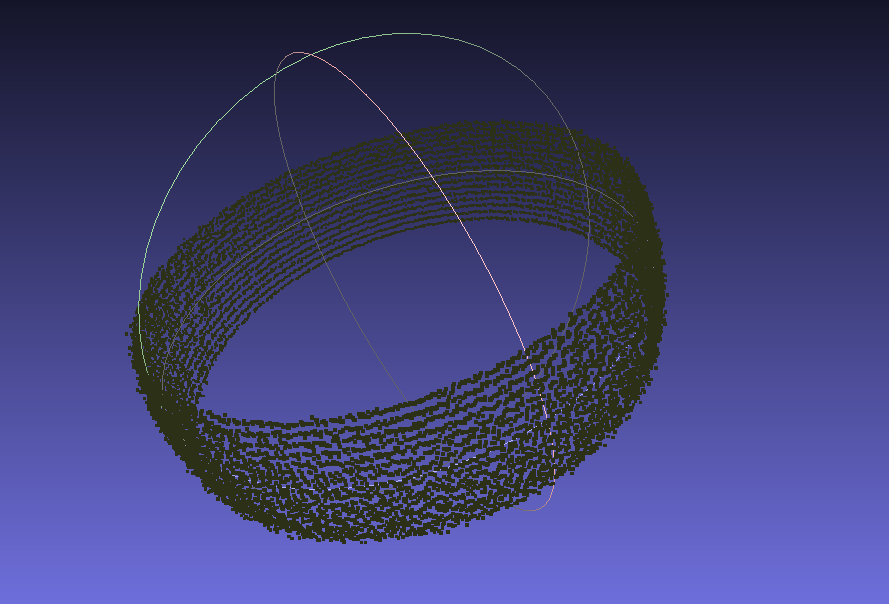
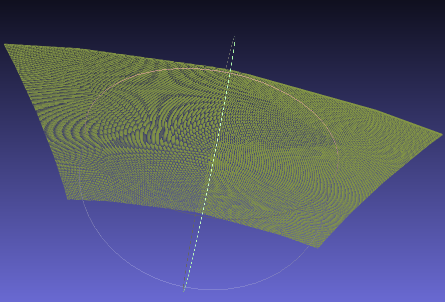
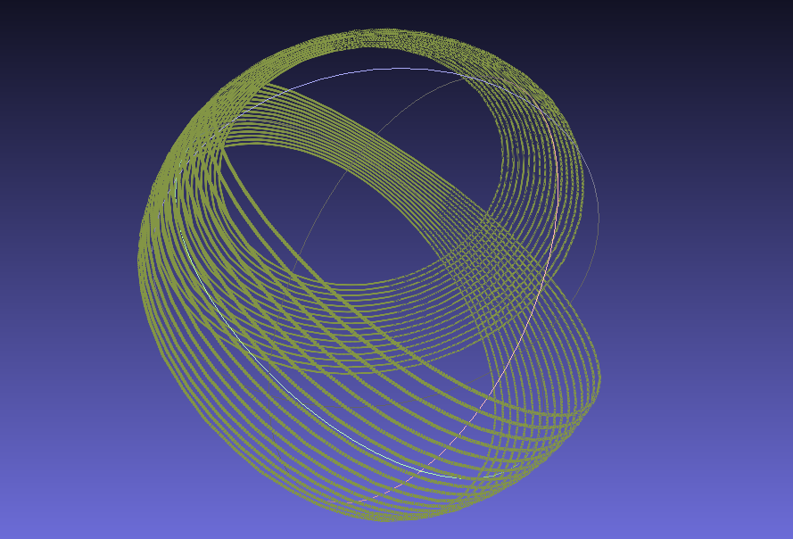
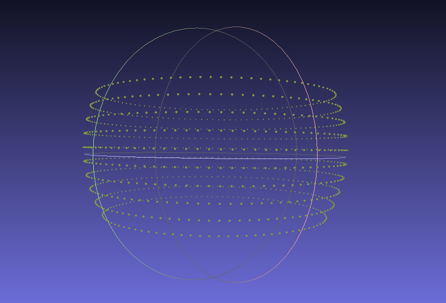
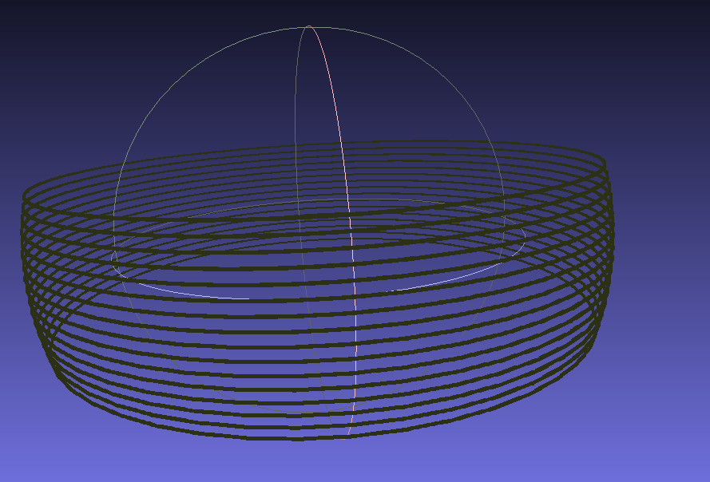
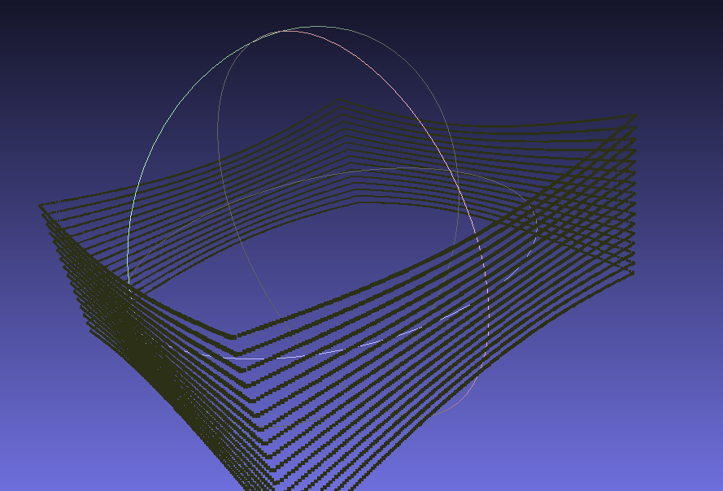

# rmagine_examples

Examples that showcase the functionalities of the [rmagine](https://github.com/uos/rmagine) library.


## Run all

```console
mkdir build
cd build 
cmake ..
make
```


## CMakeLists.txt

The CMakeLists.txt shows how to find rmagine on your system and link its components to your executables.


## Samples

X = Computing device: cpu | gpu

### example_X_sphere

```console
./example_X_sphere ../dat/sphere.ply
```

Simulates a spherical sensor model plus gaussian noise and stores the results in a XYZ file:



### example_X_pinhole

```console
./example_X_pinhole ../dat/sphere.ply
```

Simulates a pinhole sensor model and stores the results in a XYZ file:



### example_X_o1dn

Simulates a sensor model with one origin and N customized directions. The results are stored in a XYZ file: 



### example_X_ondn

Simulates a sensor model with both custom origins and directions. The results are stored in a XYZ file:



### example_X_change_map

Demonstrates how to change maps or map elements on the fly. Results for two different maps are saved to XYZ files:


| map 1 (sphere) | map 2 (cube) |
|:----:|:----:|
|   |      |


(WARNING: OptiX version shows a double free corruption error. TODO: check this)


